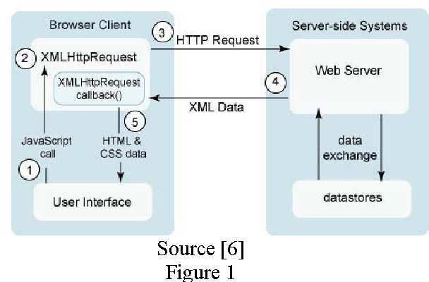

# Introducción a JavaScript

JavaScript es un lenguaje de script que se usa frecuentemente para el
desarrollo web del lado cliente.

JavaScript es una implementación del estándar ECMAScript, el cuál unicamente
define la sintaxis y las características del lenguaje y un conjunto básco de objetos
normalmente usado en los programas: `Number`, `Date`, expresiones regulares, etc.

## ¿Qué podemos hacer con JavaScript?
- Manejar interactividad en las páginas web, es decir, elementos de la interfaz gráfica
de usuarios, como menús, ventanas, gráficos, etc.
- Manipular el contenido de la página web dinámicamente
- Generar contenido HTML "al vuelo"
- Hacer validación de formularios
- AJAX
- etc.

## Ejemplo de un programa sencillo
```html
<html>
<head><title>Mi primer programa JavaScript</title></head>
<body>
  <h1>Un programa JavaScript</h1>
  <script type="text/javascript">
    document.write("<hr>");
    document.write("Hola Mundo");
    document.write("<hr>");
  </script>
</body>
</html>
```

## ¿Cómo agrego JavaScript a una página?

### Embebidos en el código HTML de la página
```html
<script type="text/javascript">
// El código JavaScript va a quí
```
Esto puede hacerse en cualquier parte de la página web. Normalmente se hace en el
encabezado del documento, o al final del mismo, antes de que se acabe el `body` de la
página web.

### En un archivo externo
```html
<script src="mi_programa.js"></script>
```

## Diálogos básicos

### Alert
Permite desplegar un mensaje en una caja de diálogo. Esta caja bloqueará al navegador
hasta que el usuario presione **aceptar**.

```javascript
alert("Esta es una alerta!");
```


### Confirm
Despliega una mensaje en una caja de diálogos con dos botones: "OK" y "Cancel". Además
retorna un valor de verdad equivalente a `true` si el usuario rpresiona "Aceptar"  en cualquier otro caso retorna el valor de verdad `false`.

```javascript
confirm("Quieres guardar la imagen?");
```


### Prompt
Despliega un mensaje y le permite al usuario ingresar un valor. Es posible especificar un 
segundo parámetro, el cual será el valor por defecto que se desplegará en el campo de
entrada. Si no se especifica este valor por defecto, no se muestra un valor en ese campo de 
entrada.

Si el usuario hace click en el botón `OK`, esta operación retorna el valor ingresado en 
el campo de texto, como una cadena de caracteres. Si el usuario presiona el botón `Cancel`,
entonces esta operación retornará `null`.

```javascript
prompt("Cuál es tu cédula?");
prompt("Cuál es tu nombre?", "No se como me llamo!");
```


## Identificadores
Para darle nombre a las variables y funciones. Deben contener unicamente letras (mayúsculas o
minúsculas), letras, el _underscore_ `_` o el símbolo pesos `$`. 

Hay que tener presente que el primer caracter no puede ser un dígito; el identificador no puede
ser una de las palabras reservadas del lenguaje y son _case sensitive_, se diferencia las 
mayúsculas de las minúsculas.

## Declaración de variables
Las variables locales se declaran usando la palabra clave `var` o `let`. Existen también 
constantes, definidas con la instrucción `const`. 

La asociación de tipos a variables es dinámica, es decir, una variable puede guardar cualquier
tipo de valor. Hay que tener en cuenta que si una variable es usada sin ser declarada, de
todas formas la variable es creada automáticamente.

```html
    <script type="text/javascript">
        x = 3;
        var y = 4;
        let z = 1;
        {
            x = 0;
            var y = 1;
            let z = 2;
        }
        alert("x = " + x + ", y = " + y + ", z = " + z);
    </script>
```

A partir de lo anterior, ¿Cuál es la diferencia entre el `var` y el `let`?

## Tipos de datos

**Tipos de datos primitivos**

* **Números**: enteros y reales
* **Booleanos**: Valores de verdad, `true` o `false`
* **Strings**: una secuencia de caracteres alfanuméricos

**Tipos de datos compuestos**

* **Object**: una colección nombrada de datos
* **Arrays**: Una secuencia de valores (también son objetos)

**Tipos de datos especiales**

* `null`: su valor representa un vacío.
* `undefined`: representa el valor una variable no inicializada.

**El operador typeof**
Un operador unario que indica el tipo de su operando.

```javascript
var x = "hola";
var y = 4, z;
alert("El valor de la variable x es de tipo " + typeof x);
alert("El valor de la variable y es de tipo " + typeof y);
alert("El valor de la variable z es de tipo " + typeof z);
```

## Los objetos

* Un objeto es una colección de **propiedades**
* Las propiedades puedes ser variables (campos) o funciones (métodos)
* Las clases de objetos se pueden definir a partir de prototipos o usando el concepto de 
clases, tal com se definen en ES6.

## Los arreglos

* Un arreglo se representan por el objeto `Array`. Para crear un arreglo de N elementos, se
puede escribir `var arr = new Array(N);`
* Los índices de los arreglos van de `0` a `N-1`.
* Pueden guardar datos de tipos diferentes
* Posee la propiedad `length`, que indica el número de elementos en el arreglo.
* Consiste de varios métodos que permite manipular sus elementos: `reverse()`, `push()`, 
`concat()`, etc.

```javascript
var carros = new Array(3);
carros[0] = "Ford";
carros[1] = "Toyota";
carros[2] = "Honda";

// También podemos crear un arreglo con sus valores iniciales
var carros2 = new Array("Ford", "Toyota", "Honda";

// o se puede crear un arreglo con sus valores iniciales
var carros3 = ["Ford", "Toyota", "Honda"];
```

## Operadores

### Operadores aritméticos
* `+, -, *, /, %`
* `++, --`
* El operador `+` aplicado a Strings realiza la concatenación de la información.

### Operadores de comparación
* `==, !=, >, >=, <, <=`
* `===, !==`, (estrictamente iguales o estrictamente no iguales)

### Operadores lógicos
* `!` - el no lógico
* `&&` - El Y lógico. O sea si `OP1 && OP2` es `true` es porque ambos OP son `true`.
* `||` - El O lógico. Si tenemos que `OP1 || OP2` es `false` es porque ambos OP son `false`.

### Operadores de asignación
* `=, +=, -=, *=, /=, %=`

### Operadores sobre bits
* `&, |, ^, >>, <<, >>>`

## Instrucciones Condicionales
* Sentencia `if` 
* Sentencia `if` ... `else`
* Operador ternario `? :`
* Sentencia `switch`

## Instrucciones repetitivas
* Repetición con el `for`
* Repetición con el `for/in`
* Repetición con `while`
* Repetición con `do ... while`
* Sentencia `break`
* Sentencia `continue`

## Funciones
Una función es un bloque de código diseñado para desarrollar una tarea particular. Esta función
se ejecuta cuando "alguien" o "algo" la invoca (la llama).


```javascript
function mayorde3(a, b, c) {
  if (a > b && a > c) {
    return a;
  }
  else if (b > a && b > c) {
    return b;
  }
  return c;
}

var num_mayor = mayorde3(10, 8, 15);
alert(num_mayor);
```

## El objeto Window
A través del objeto `window` se puede controlar los elementos en una página web, dando la 
posibilidad de acceder y manipular las diversas partes del navegador por si mismo. Las
siguientes son propiedades y métodos de este objeto:

| **Propiedad/método** | **Descripción** |
|----------------------|-----------------|
| `event`              | Representa el estado de un evento |
| `history`            | Contiene las direcciones que el usuario ha visitado |
| `location`           | Permite saber o modificar la página actual del browser |
| `status`             | Cambia u obtiene el texto en la barra de estado |
| `alert()`            | Mostrar un mensaje |
| `close()`            | Cierra la ventana actual |
| `confirm()`          | Despliega un caja de diálogo |
| `focus()`            | Establece el foco en la ventana actual |

## Eventos
Un evento ocurre como resultado de alguna actividad en el browser. Por ejemplo,
* El usuario hace click sobre un enlace en la página
* La página termino de cargarse o desplegarse
* El cursor del mouse entra en un área determinada
* Pasa una cantidad de tiempo dada
* Un formulario está siendo enviado al servidor

### Gestor de eventos
Estos son segmentos de códigos (usualmente una función) que se ejecutará cuando un evento 
ocurre. Estos gestores de eventos se pueden definir en la página web de la siguiente 
manera:
* Como un atributo de un elemento HTML
* Como un método asociado a un elemento dado
* Usando el método `addEventListener()`

La siguiente es una lista de gestores de eventos

| **Gestor de eventos** | **Descripción de eventos** |
|-----------------------|----------------------------|
| `onblur`              | Un elemento pierde el foco |
| `onchange`            | En contenido de un campo de un formulario cambia |
| `onclick`             | Un click del mouse ocurre sobre un objeto |
| `onkeydown`           | Una tecla en el teclado fue presionada |
| `onkeypress`          | Una tecla en el teclado fue presionada y soltada |
| `onkeyup`             | Una tecla en el teclado fue soltada |
| `onload`              | Una página o una imagen se terminó de cargar |
| `onmouseover`         | Cuando el mouse se pasea encima de un determinado elemento |
| `onsubmit`            | Cuando el botón `submit` fue presionado en un formulario |

Se puede definir un gestor de evento como atributo de la siguiente manera:
```html
<body onclick="miFuncion();">
  <h1>Un programa JavaScript</h1>
</body>
```

También es posible definir el gestor de eventos como un atributo del objeto afectado:
```javascript
window.onload = miFuncion;
```

Y finalmente, también es posible utilizar el método `addEventListener` para asignarle 
una función ante la ocurrencia de un determinado evento:
```javascript
window.addEventListener("click", miFuncion);
```

## Trabajando con el DOM

El **Document Object Model** o sencillamente el **DOM**, es una interface de progración
para las páginas HTML y XML. Proporciona una versión estructurada y jerárquica del documento, 
así como un conjunto de métodos para interactuar con los elementos contenidos allí. 

El DOM permite ver una página web como un conjunto jerárquico de nodos. Estos nodos pueden
ser de los siguientes tipos:
* Nodos elementos
* Nodos atributos
* Nodos de texto

Podemos tener acceso a los diversos nodos de un documento a través de las siguientes operaciones

* Por nombre del elemento: `getElementByTagName`

```javascript
  var parrafos = document.getElementsByTagName("p");
  for (var i = 0; i < parrafos.length; ++i) {
    // Hacer algo aquí
  }
```

* Por el identificador de un elemento `getElementById`
```html
  

  <script>
    var foto = document.getElementById("miFoto");
  </script>
```

* A través del valor del atributo `class`: `getElementsByClassName`
* A través de un selector CSS: `querySelectorAll`
```javascript
  var parAlLado = document.querySelectorAll(".alLado p");
  var inputTexto = document.querySelectorAll("input[type='text']");
```

* Accesando el valor de un atributo: `getAttribute`
```javascript
  var foto = document.getElementById("miFoto");
  alert(foto.getAttribute("src"));
```

También es posible manipular el contenido de la página web a través del siguiente conjunto
de operaciones.

* Cambiar un atributo de un nodo: `setAttribute`
```javascript
  var foto = document.getElementById("miFoto");
  foto.setAttribute("src", "otraforo.jpg");
```

* Cambiar el texto y el código HTML dentro de un elemento: `innerHTML`
```javascript
  var introDiv = document.getElementsByClassName("intro");
  introDiv[0].innerHTML = "<p>Este es el texto introductorio</p>";
```

* Cambiar, modificar o eliminar el estilo CSS de un elemento: `style`
```javascript
  document.getElementById("intro").style.color = "#FFFFFF";
  document.getElementById("intro").style.backgroundColor = "#F58220";
```

* Agregar elementos a una página: `createElement`, `createTextNode`, `appendChild`, 
`insertBefore`.
* Reemplazar y eliminar elementos: `replaceChild`, `removeChild`


## Introducción a JQuery
[JQuery](http://jquery.com) es un conjunto de funciones y objetos en JavaScript con el propósito de hacer mucho más
fácil el uso de este lenguaje en el desarrollo de aplicaciones web.

Esta simplificación se da en tres campos principalmente:
* Recorrer el DOM de la página así como su modificación
* La gestión de eventos
* AJAX

### Incluir JQuery en una página web
* Descargarlo y usarlo localmente
```javascript
<head>
<script src="jquery-3.3.1.min.js"></script>
</head>
```

* Usando una CDN global (por ejemplo, el de Google)
```javascript
<head>
<script src="https://ajax.googleapis.com/ajax/libs/jquery/3.3.1/jquery.min.js"></script>
</head>
```

### Programando con JQuery
Cuando construimos programas con JQuery, seleccionamos (_query_) elementos HTML y luego desarrollamos acciones sobre
ellos. La sintaxis básica para realizar la selección es: **_$(selector).action()_**

La mayoría de las acciones básicas de una página se aconseja realizarla cuando la página se termina de cargar en
el navegador. Esto se hace a través del siguiente gestor de eventos:
```javascript
$(document).ready(function(){

   // Aquí van las acciones iniciales...

});
```

#### Selectores
* Seleccionar todos los elementos por tag: `$("p")`
* Seleccionar un elemento por Id: `$("#miParrafo")`
* Seleccionar todos los elementos que pertenecen a una clase: `$(".clase")`

### Eventos
Para indicarle a un objeto que va a gestionar un evento, se realiza a través de una sintaxis simplificada
tal como `$(selector).evento(función)`.

* `$(document).ready()` ejecutar una función cuando el documento está totalmente cargado.
* `click()` cuando el usuario hace click sobre un elemento HTML. Por ejemplo, el siguien código esconde un párrafo
cuando el usuario hace click sobre él.
```javascript
$("p").click(function(){
  $(this).hide();
});
```
* `dblclick()` cuando el usuario hace doble click sobre un elemento HTML
* `mouseenter()` cuando el mouse entra en un determinado elemento HTML
* `mouseleave()` al momento que el mouse sale de un determinado elemento HTML
* `hover()` toma dos funciones, una cuando el usuario entra al elemento, y la segunda cuando el mouse sale del elemento
* `focus()` se ejecuta cuando el campo de un formulario obtiene el foco
* `blur()` se ejecuta cuando el campo de un formulario pierde el foco
* `on()` para asociar varios gestores de eventos al mismo conjunto de elementos. Ejemplo:
```javascript
$("p").on({
    mouseenter: function(){
        $(this).css("background-color", "lightgray");
    }, 
    mouseleave: function(){
        $(this).css("background-color", "lightblue");
    }, 
    click: function(){
        $(this).css("background-color", "yellow");
    } 
});
```

### Manipulación del DOM
* Para obtener el contenido de un elemento HTML usando jQuery tenemos los siguientes métodos
  - `text()` para obtener o cambiar el contenido textual del elemento
  - `html()` para obtener o cambiar el contenido del elemento en formato HTML
  - `val()` para obtener o cambiar el valor de los campos de un formulario

* Ejemplo:
```javascript
$("#btn1").click(function(){
    alert("Texto: " + $("#parrafo").text());
});
$("#btn2").click(function(){
    alert("HTML: " + $("#parrafo").html());
});
$("#btn3").click(function(){
    alert("Valor: " + $("#nombre").val());
});
```

* Para obtener el atributo de un elemento, podemos usar el método `attr()` del selector dado
```javascript
$("boton").click(function(){
    $("#imagen").attr("src", "unaFoto.jpg");
});
```

### Estilos al estilo jQuery
Para cambiar u obtener propiedades CSS de un determinado objeto usando jQuery, tenemos el método `css()`. Los siguientes
ejemplos nos ilustran su uso:
```javascript
alert($("#miParrafo").css("color"));

// Cambiar la posicion de un elemento
$("#laCasa").css("top", posicion + "px");

// También podemos cambiar muchas propiedades al tiempo
$("#miParrafo").css({"background-color": "yellow", "font-size": "36"}});
```

## Ajax?
Ajax es un esquema de comunicación entre el un cliente (el browser) y un servidor usando el protocolo HTTP. Usa una combinación de

* Un objeto XMLHttpRequest para solicitar información al servidor
* Un programa JavaScript y el DOM de HTML para desplegar o usar los datos.

### Cómo trabaja AJAX?



* Hay que crear el objeto en el programa JavaScript

```javascript
var req = new XMLHttpRequest();
```

#### Métodos de un Objeto XMLHttpRequest

| Método | Descripción |
|--------|-------------|
| `abort()` | Cancela el requerimiento actual |
| `getAllResponseHeaders()` | Obtener la información del encabezado |
| `getResponseHeader()` | Obtener información específica del encabezado |
| `open(metodo, url, async, usr, pwd)` | Requerimiento |
| `send()` | Envia el requerimiento al sevidor |
| `send(req)` | Envia el requerimiento al servidor |
| `setRequestHeader()` | Agregar un par variable/valor en el encabezado a ser enviado |

#### La propiedad onreadystatechange

Define una función que se va a invocar cuando la propiedad `readyState` cambia. Podemo además usar las propiedades siguientes:

* `readyState`: Contiene el estado actual del requerimiento. Es un número y puede ser alguno de los siguientes:
- 0: Requerimiento no inicializado
- 1: Se estableción conexión con el servidor
- 2: Se recibió el requerimiento en el lado servidor
- 3: El servidor está procesando el requerimiento
- 4: El requerimiento finalizó y la respuesta está lista
* `status`: Puede ser alguna de las siguientes:
- 200: Todo bien
- 403: Página prohibida
- 404: Pàgina no encontrada
* `statusText`: mensaje correspondiente al `status` anterior.

```javascript
function traerInformacion() {
    var xhttp = new XMLHttpRequest();
    xhttp.onreadystatechange = function() {
        if (this.readyState == 4 && this.status == 200) {
            document.getElementById("info").innerHTML = this.responseText;
       }
    };
    xhttp.open("GET", "programa.asp", true);
    xhttp.send(); 
}
```

### Ajax en jQuery

jQuery también simplifica la construcción de requerimientos en Ajax. Para ello nos brinda los siguientes métodos:

* `$(selector).load(URL, datos, función)`: trae datos desde el servidor en los objetos seleccionados.

```javascript
$("traerDatos").click(function(){
    $("#div1").load("infoProducto.aspx", function(responseTxt, statusTxt, xhr){
        if(statusTxt == "success")
            alert("Información obtenida correctamente!");
        if(statusTxt == "error")
            alert("Error: " + xhr.status + ": " + xhr.statusText);
    });
});
```

* `$.get(URL, función)`: para realizar un requerimiento GET al servidor

```javascript
$("boton").click(function(){
    $.get("demo.asp", function(data, status){
        alert("Datos: " + data + "\nStatus: " + status);
    });
});
```

* `$.post(URL, datos, función)`: envía un requerimiento al servidor usando el método POST

```javascript
$("agregar").click(function(){
    $.post("agregarProducto.asp",
    {
        nombre: nom,
        cantidad: cant
    },
    function(data, status){
        alert("Data: " + data + "\nStatus: " + status);
    });
});
```

* `$.ajax(opciones)`: desarrolla un requerimiento AJAX de forma asincrónica. Es mucho más específica y entre las opciones se pueden
indicar las siguientes: `async`, `data`, `type`, `success`, etc.
